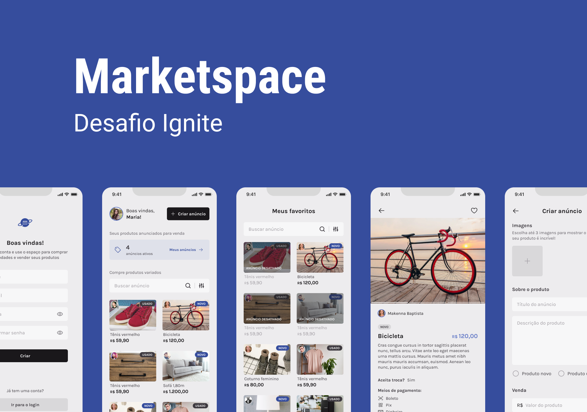

# Challenge - Marketspace

## Índice

- [Overview](#overview)
  - [The project](#the-project)
  - [Screenshot](#screenshot)
- [Development process](#development-process)
  - [Built with](#built-with)
- [How to run the project](#how-to-run-the-project)

## Overview

<!-- ### Sobre o projeto:

Os usuários devem ser capazes de:

- Crie uma conta e faça login
- Registrar novas pizzas
- Listar cardápio de pizza
- Fazer um pedido
- Gerenciamento de pedidos -->

### Screenshots

## Processo de desenvolvimento

### Construído com:

- React Native
- Expo
<!-- - Image Picker
- File System
- Native Base
- React HookForm
- Yup -->

## Como executar o projeto:

Clone o repositório usando "git clone". Depois disso, vá para a pasta do projeto e use o comando "npm install" ou "yarn install" para instalar as dependências.

Por fim, use o comando "npm run android" ou "yarn android" para iniciar o projeto (lembre-se de ter o emulador ou dispositivo conectado ou usar o comando apropriado para iOS).
